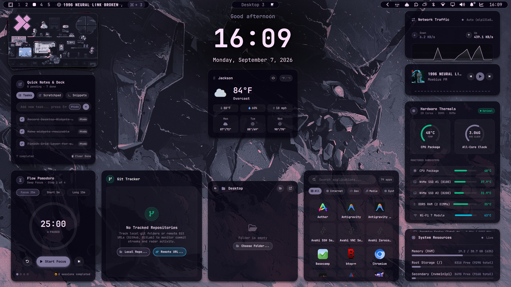
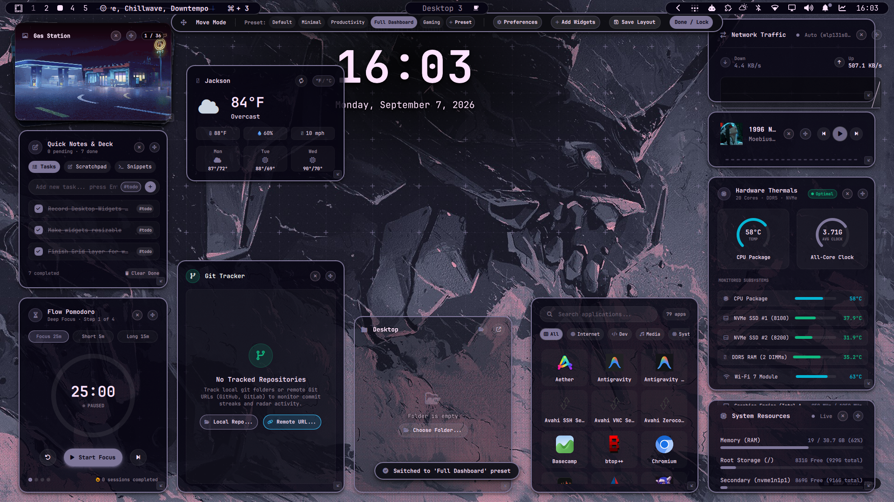
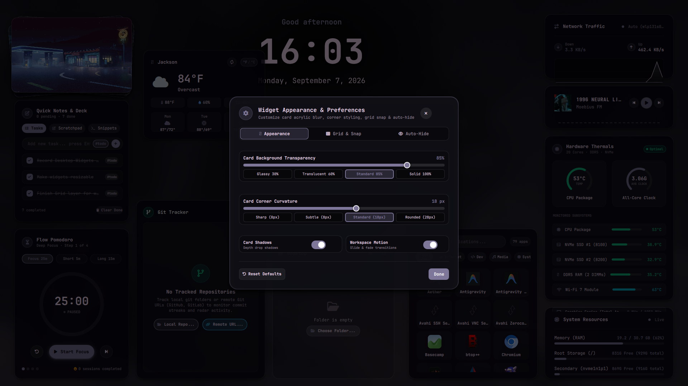

# Omarchy Desktop Widgets



A suite of high-performance, aesthetic desktop widgets for Omarchy Linux running on Hyprland and Quickshell.

Featuring a 3D photo stack gallery, real-time network traffic sparklines, CPU/GPU hardware telemetry, an 84-day git activity radar, a Pomodoro timer, scratchpad notes, an ambient hero clock, MPRIS media controls, and multi-disk system monitors.

---

## ✨ Included Widgets

### Core Built-in Widgets
1. **🕒 Hero Clock & Weather** (`HeroClockWidget.qml`)
   - Centered clock with expansive ambient radial drop shadow backdrop.
   - Live weather status (temperature, condition icon, descriptions via wttr.in).
   - Dynamic time-of-day greeting ("Good morning", "Late night vibes").
   - Configurable 12h/24h time, seconds display (`:SS`), and compact date format.
2. **📸 3D Layered Photo Stack Gallery** (`PhotoGalleryWidget.qml`)
   - Realistic multi-angle 3D photo deck with full-bleed images and hardware-accelerated rounded corners (`MultiEffect`).
   - Natural depth shading, drop shadows, and interactive hover fan-out.
   - Folder selector (Wallpapers, Pictures, custom directories with Zenity file dialog).
   - Configurable auto-cycle timing (10s, 30s, 1m, 5m, 15m, or paused) and manual shuffle button.
3. **🌐 Real-time Network Traffic Monitor** (`NetworkTrafficWidget.qml`)
   - Dual real-time sparkline area chart graphing upload and download bandwidth simultaneously.
   - Current upload/download speeds and cumulative session byte counters.
   - **Popout Device Selector**: Right-click context menu flyout to choose which network device is actively monitored (Wi-Fi, Ethernet, Tailscale VPN, Docker/bridge, Loopback, or Auto-detect).
4. **💾 System Resources & Storage Matrix** (`SystemResourcesWidget.qml`)
   - Live RAM memory usage gauge with optional compact percentage format.
   - Multi-drive storage monitor tracking Root (`/`), external drives, and secondary mount points.
   - Monitored drive checkboxes to select which drives are displayed on the desktop.
5. **🎵 MPRIS Media Player** (`MediaPlayerWidget.qml`)
   - Seamless media playback control (Play/Pause, Next, Prev) with album artwork and track metadata.
   - Integrated live audio spectrum visualizer bar.
   - MPRIS audio source picker to switch between active media players (Spotify, Firefox, Chromium, mpv).

### Productivity & Developer Widgets
6. **📝 Quick Notes & Todo Deck** (`widgets/quick-notes/QuickNotesWidget.qml`)
   - Floating Kanban-style todo deck with tag pills (`#work`, `#todo`, `#idea`, `#done`).
   - Markdown scratchpad instantly synchronized to local markdown and JSON files.
7. **⏱️ Circular Pomodoro Timer** (`widgets/pomodoro/PomodoroWidget.qml`)
   - Flow-state countdown timer with SVG circular progress ring.
   - Focus sessions (25m), short breaks (5m), and long breaks (15m) with audio chimes.
8. **⚡ Hardware Telemetry Monitor** (`widgets/hardware-telemetry/HardwareTelemetryWidget.qml`)
   - Dual radial gauge matrix for CPU and GPU utilization, clock frequencies, temperatures, and VRAM.
   - Native integration with NVIDIA, AMD, and Intel hardware sensors.
9. **🌿 Git Activity & Contribution Radar** (`widgets/git-activity/GitActivityWidget.qml`)
   - 84-day GitHub-style contribution heatmap and commit pulse.
   - Branch status, uncommitted diff counter, and recent commit history log.
   - **Repository Switcher**: Monitor specific local projects or toggle **All Repositories** aggregate mode.

10. **☀️ Weather Forecast & 3-Day Outlook** (`widgets/WeatherWidget.qml`)
    - Dedicated live weather card featuring current conditions and temperature with one-click °F / °C toggle.
    - Atmospheric metrics: feels-like temperature, humidity percentage, wind speed, and condition-tinted icons.
    - 3-day forecast strip showing upcoming weather icons and daily high/low temperatures.
11. **🚀 Desktop Application Launcher** (`widgets/AppLauncherWidget.qml`)
    - Fast desktop app grid with instant live search filtering and category chips (All, Internet, Dev, Media, System, Utilities, Games).
    - Native system icon theme integration (Papirus / active theme) with fallback category glyphs.
    - One-click application launching and smooth micro-animations.
12. **📂 Transparent Folder View Portal** (`widgets/FolderViewWidget.qml`)
    - Transparent or frosted glass desktop card displaying files and directories (defaults to `~/Desktop`).
    - Full `.desktop` launcher shortcut support with actual application names and icons.
    - Interactive directory drill-down with breadcrumb back navigation and native file chooser dialog.

All 12 widgets are built-in and available right out of the box from the desktop **Add Widgets** drawer or right-click wallpaper menu.

---

## 🚀 Installation

### Option 1: Install as Omarchy Plugin (Recommended)
Clone directly into your Omarchy plugins directory and reload the shell:

```bash
omarchy plugin add https://github.com/cyelis1224/omarchy-desktop-widgets.git --enable
```

### Option 2: Custom Widget Development Workspace
If you are developing your own third-party custom widgets, clone to your projects directory:

```bash
git clone https://github.com/cyelis1224/omarchy-desktop-widgets ~/Projects/desktop-widgets
```

To register any new third-party custom widget with Omarchy:
```bash
~/Projects/desktop-widgets/scripts/import-widget.sh path/to/MyCustomWidget.qml "My Custom Widget"
```

---

## 🎮 Controls & Interaction

### 🌓 Shaded Widget Overlay & Keybinding
The desktop widgets feature an interactive shaded backdrop overlay that elevates your widgets above open application windows and frosted blur on demand.

- **Manual Toggle Command**:
  ```bash
  omarchy-shell -q dagyr.desktop-widgets toggle
  ```
- **Setting up a Custom Keybinding (Omarchy / Hyprland)**:
  Add the binding to your `~/.config/hypr/bindings.lua` file:
  ```lua
  -- Toggle Desktop Widgets Shaded Overlay (e.g. Super + Shift + W)
  hl.unbind("SUPER + SHIFT + W") -- Unbind if previously mapped
  o.bind("SUPER + SHIFT + W", "Toggle Desktop Widgets", "omarchy-shell -q dagyr.desktop-widgets toggle")
  ```
  *(Changes to `bindings.lua` take effect immediately upon saving).*

- **Overlay Behavior**:
  - **Full-Screen Shaded Backdrop**: Deploys a dedicated backdrop surface (`omarchy-desktop-shade`) on `WlrLayer.Overlay` covering all active windows and the top bar (`omarchy-bar`).
  - **Selective Blur**: Hyprland layer blur is applied behind the backdrop shade, creating a frosted glass effect behind your open apps without blurring the widgets or their drop shadows.
  - **Interactive Dismissal**: The overlay automatically and smoothly dismisses whenever you:
    - Press the `Escape` key.
    - Click anywhere on the dark shaded backdrop.
    - Switch workspaces (navigating to another workspace immediately resets widgets to their desktop layer).
    - Trigger the toggle keybinding again.

- **Hyprland Layer Blur Configuration**:
  To enable backdrop blur for the shaded overlay, ensure `omarchy-desktop-shade` is included in your layer rules in `~/.config/hypr/windowrules.lua`:
  ```lua
  local blur_layers = { "omarchy-bar", "rofi", "notifications", "swaync-notification-window", "swaync-control-center", "logout_dialog", "omarchy-desktop-shade" }
  for _, layer in ipairs(blur_layers) do
    hl.layer_rule({ match = { namespace = layer }, blur = true, ignore_alpha = 0 })
  end
  ```
  Apply with `hyprctl reload`.

---

### 🖱️ Widget Interaction & Management

- **Double-Click Blank Desktop to Show/Hide**:
  - Double-clicking on empty wallpaper or blank space between windows toggles widget visibility.
  - On an empty workspace: smoothly fades out all desktop widgets to display an uncluttered wallpaper; double-clicking blank space again instantly restores them.
  - On a workspace with open windows: double-clicking exposed desktop gaps summons the shaded frosted overlay.
- **Right-Click Context Menu**:
  - Right-click anywhere on any widget body to open its options menu.
  - Selecting any setting option automatically saves your preference and dismisses the context menu.
- **Move Mode (Layout Lock/Unlock)**:
  - Select **Unlock Widgets Layout (Move Mode)** from any widget's context menu.
  - Drag widgets freely across your desktop with smooth physics, drag scale feedback (`1.025×`), and 20px grid snapping.
  - Click **Done / Lock** in the floating top banner when finished.
- **Interactive Resizing**:
  - In Move Mode, resize handles appear on the bottom-right corner (width & height), right edge (width), and bottom edge (height).
  - A real-time dimension pill (`W × H px`) displays current size with 20px snap-to-grid on release.
- **Persistent Preferences**:
  - All widget positions, dimensions, enabled states, and custom settings (e.g. 12h/24h time, seconds display, monitored network devices, cycle speeds, theme modes) are persisted to `~/.local/state/omarchy/dagyr.desktop-widgets.json`.

---

## 🗂️ Multi-Profile Layouts & Sharing

Omarchy Desktop Widgets features a complete profile management system allowing you to switch between distinct widget workflows, back up arrangements, share configurations, and retain monitor-specific coordinates.

### 🌟 Named Layout Presets
Five curated profiles are built-in and ready out of the box:
- **Default**: Standard balanced desktop setup with Hero Clock, Photo Deck, Network Sparklines, MPRIS Media, and System Specs.
- **Minimal**: Distraction-free glance layout featuring only the centerpiece clock and weather forecast.
- **Productivity**: Focus workspace equipped with Pomodoro timer, Kanban todos, Git radar, and Folder view.
- **Full Dashboard**: Comprehensive 12-widget command center arranged across the canvas.
- **Gaming**: Performance telemetry layout tracking CPU/GPU stats, RAM, multi-drive storage, and network bandwidth.



### ⚡ Quick-Switching & IPC Commands
- **Top Move Mode Banner**: When Move Mode is unlocked, click any preset pill (`Default`, `Minimal`, `Productivity`, `Full Dashboard`, `Gaming`) to switch immediately.
- **Desktop Right-Click Menu**: Right-click blank desktop wallpaper ➜ **Layout Presets ▸** to view the active checkmark and switch profiles.
- **CLI / Scripting IPC**:
  ```bash
  # Switch to any layout preset via CLI or hotkey
  omarchy-shell -q dagyr.desktop-widgets profile "Productivity"
  omarchy-shell -q dagyr.desktop-widgets profile "Minimal"
  ```

### 💾 Import & Export Profiles
- **Exporting**: Right-click wallpaper ➜ **Layout Presets ▸** ➜ **Export Current Preset...** opens a native file dialog to save a portable `.json` layout profile.
- **Importing**: Select **Import Preset JSON...** to load community profiles or restore previous layouts.
- **File Format**: Standard portable JSON schema:
  ```json
  {
    "version": "1.0",
    "type": "omarchy-desktop-widgets-profile",
    "profile": {
      "name": "My Setup",
      "enabled_widgets": ["clock", "weather", "media"],
      "positions": {
        "clock": { "x": 780, "y": 40 },
        "weather": { "x": 780, "y": 240, "w": 340, "h": 260 }
      }
    }
  }
  ```

### 🖥️ Multi-Monitor Awareness
Desktop Widgets automatically tracks which display you place each widget on (`eDP-1`, `DP-1`, `HDMI-A-1`). When disconnecting an external monitor or docking your laptop, widget coordinates are remembered independently per display output without overlapping or resetting your arrangements.

---

## 🎨 Visual Polish & Appearance Controls

Personalize every visual aspect of your desktop widgets using the integrated **Widget Preferences Dialog**.

### ⚙️ Preferences Dialog (`PreferencesDialog.qml`)
Open the preferences dialog at any time via:
- Right-click desktop wallpaper ➜ **Widget Preferences...**
- Click the **Preferences** button in the top Move Mode banner.
- CLI: `omarchy-shell -q dagyr.desktop-widgets preferences`



### 🎛️ Customization Controls

1. **Card Background Transparency & Acrylic Blur**:
   - Live continuous slider from 15% (ultra glassy acrylic) to 100% (solid opaque cards).
   - Quick preset chips: *Glassy 30%*, *Translucent 60%*, *Standard 85%*, *Solid 100%*.
2. **Corner Curvature Radius**:
   - Live continuous slider from 0px (sharp square) to 32px (smoothly rounded).
   - Quick preset chips: *Sharp (0px)*, *Subtle (8px)*, *Standard (18px)*, *Rounded (28px)*.
3. **Drop Shadows**:
   - High-depth hardware-accelerated ambient drop shadows with smooth on/off toggle.
4. **Grid Snapping Precision**:
   - Choose your snapping precision during drag and resize operations:
     - **Freeform (1px)**: Pixel-perfect freedom with no snapping restriction.
     - **Fine (10px)**: Compact, high-precision layout alignment.
     - **Standard (20px)**: Default balanced alignment grid.
     - **Coarse (40px)**: Bold modular alignment for large displays.
5. **Auto-Hide Behavior Modes**:
   - Customize when widgets automatically hide beneath applications:
     - **Hide on Any Window (Tiled)** *(Default)*: Widgets hide whenever any window is active on the current workspace.
     - **Hide on Fullscreen Only**: Widgets stay visible beneath floating and tiled windows, hiding only when an app goes fullscreen.
     - **Always Keep Visible**: Widgets remain permanently rendered on the desktop canvas behind windows.
     - **Manual Toggle Only**: Widgets disregard window states; toggle manually via top bar or shortcut.
6. **Workspace Slide & Fade Transitions**:
   - Smooth fluid slide and fade animations when switching between virtual workspaces.

---

## 🛠️ Developing Custom Widgets with `WidgetCard.qml`

All desktop widgets inherit from the base card component (`shared/WidgetCard.qml` / `widgets/WidgetCard.qml`). This base architecture provides all container styling, windowing physics, and settings persistence so you (or your AI coding agent) only need to focus on building the inner content of your widget.

### 🧩 What `WidgetCard.qml` Provides Automatically

| Feature | Description |
| :--- | :--- |
| **Glassmorphic Surface** | Adaptive translucent background (`Color.bar.background`), 18px corner radius, responsive border highlights, and hardware-accelerated `MultiEffect` drop shadows. |
| **Default Content Slot** | Any QML child elements declared directly inside `WidgetCard { ... }` automatically populate the inner card body (`default property alias content: contentContainer.data`). |
| **Optional Header** | Set `showHeader: true`, `title: "..."`, and `icon: "\uf005"` to automatically render a standardized header with icon, title, and close buttons during Move Mode. |
| **Move & Drag Physics** | Integrated 20px grid snapping, smooth scale-up animation during drag, screen edge collision clamping, and automatic coordinate persistence. |
| **3-Axis Resizing** | Built-in corner and edge resize handles with min/max boundary constraints (`minWidth`, `minHeight`, `maxWidth`, `maxHeight`) and live dimension tooltip badge. |
| **Right-Click Context Menu** | Standard menu with "Unlock Widgets Layout", "Reset Positions", and widget toggle, expandable via `customMenuContent: Component { ... }`. |
| **State Persistence API** | Built-in methods (`saveSetting`, `getSetting`, `saveSettings`, `settingsLoaded`) connected directly to Omarchy's persistent JSON state storage. |
| **Screen Geometry Access** | `screenWidth`, `screenHeight`, and `rootRef` access for responsive calculations. |

---

### 📋 Custom Widget Boilerplate Template

Here is a complete, production-ready template demonstrating how to create a custom widget with persistent state and custom context menu options:

```qml
import QtQuick
import QtQuick.Layouts
import Quickshell
import qs.Commons
import qs.Ui
import "../../shared"

WidgetCard {
  id: myCustomWidget
  widgetId: "my_custom_widget"
  title: "Pomodoro Focus"
  icon: "\uf252"          // Nerd Font icon glyph
  showHeader: true        // Set to true for title bar, false for minimal/borderless cards
  width: 320
  height: 220
  minWidth: 260
  minHeight: 180

  // 1. Reactive Widget State
  property bool showExtraDetails: true
  property int refreshIntervalSeconds: 30

  // 2. Load Saved Preferences on Initialization
  Component.onCompleted: {
    showExtraDetails = getSetting("showExtraDetails", true)
    refreshIntervalSeconds = getSetting("refreshIntervalSeconds", 30)
  }

  // React if settings are reloaded from disk
  onSettingsLoaded: {
    showExtraDetails = getSetting("showExtraDetails", true)
    refreshIntervalSeconds = getSetting("refreshIntervalSeconds", 30)
  }

  // 3. Widget Body (Automatically placed into contentContainer)
  ColumnLayout {
    anchors.fill: parent
    anchors.margins: Style.space(16)
    spacing: Style.space(10)

    Text {
      text: "Custom Widget Body"
      font.family: Style.font.family
      font.pixelSize: Style.font.titleSmall
      font.weight: Font.Bold
      color: Color.foreground
    }

    Text {
      visible: myCustomWidget.showExtraDetails
      text: "Detailed telemetry and metrics here..."
      font.family: Style.font.family
      font.pixelSize: Style.font.bodySmall
      color: Color.muted
    }

    Item { Layout.fillHeight: true }
  }

  // 4. Custom Right-Click Context Menu Items
  customMenuContent: Component {
    ColumnLayout {
      spacing: Style.space(4)

      // Toggle Option
      Rectangle {
        Layout.fillWidth: true
        implicitHeight: 30
        radius: 6
        color: optMouse.containsMouse ? Qt.rgba(1, 1, 1, 0.08) : "transparent"

        RowLayout {
          anchors.fill: parent
          anchors.leftMargin: 8
          anchors.rightMargin: 8
          spacing: 8

          Text {
            text: myCustomWidget.showExtraDetails ? "\uf058" : "\uf10c"
            font.family: Style.font.family
            font.pixelSize: 12
            color: myCustomWidget.showExtraDetails ? Color.accent : Color.muted
          }

          Text {
            text: "Show Extra Details"
            font.family: Style.font.family
            font.pixelSize: 11
            color: Color.foreground
          }
        }

        MouseArea {
          id: optMouse
          anchors.fill: parent
          hoverEnabled: true
          cursorShape: Qt.PointingHandCursor
          onClicked: {
            myCustomWidget.showExtraDetails = !myCustomWidget.showExtraDetails
            myCustomWidget.saveSetting("showExtraDetails", myCustomWidget.showExtraDetails)
            myCustomWidget.contextMenuOpen = false
          }
        }
      }
    }
  }
}
```

---

### 📦 Registering & Testing Your Widget

1. **Test with Quickshell Runner**:
   ```bash
   ~/Projects/desktop-widgets/scripts/test-widget.sh ~/Projects/desktop-widgets/widgets/my-widget/MyWidget.qml
   ```
2. **Register into Omarchy Plugin**:
   ```bash
   ~/Projects/desktop-widgets/scripts/import-widget.sh ~/Projects/desktop-widgets/widgets/my-widget/MyWidget.qml "My Custom Widget"
   ```
3. **Restart the Omarchy Shell**:
   ```bash
   omarchy restart shell
   ```

---

## 🔔 Status Bar Update Indicator & Updater Dialog

The plugin includes an automatic update indicator on the Omarchy status bar:
- **Zero Bar Clutter**: When up-to-date, the widget remains completely hidden (`visible: false`, 0 width) so it takes up no bar space.
- **Update Notification**: When an update is detected on the upstream GitHub repository, an indicator icon (`\uf019` with a subtle pulsing accent badge) appears on the top bar.
- **Interactive Review Window**: Clicking the icon opens a themed dialog window (`PopupCard`) displaying:
  - **Current Version** vs **New Version** comparison cards with git commit hashes.
  - **What's New / Summary**: Displays upstream commit count and latest release/commit message.
  - **"Update Now" Button**: Automatically fetches the update, pulls git changes, validates the plugin, and reloads the shell without losing your layout.
  - **"Cancel" Button**: Dismisses the review window.

### Testing & Manual Controls
You can manually check or simulate update states via CLI:
```bash
# Check current update status
~/.config/omarchy/plugins/dagyr.desktop-widgets/scripts/check-update.sh check

# Simulate an update (enables mock update mode and shows the bar icon)
~/.config/omarchy/plugins/dagyr.desktop-widgets/scripts/check-update.sh mock-on
omarchy-shell dagyr.desktop-widgets-update check

# Clear simulated update mode
~/.config/omarchy/plugins/dagyr.desktop-widgets/scripts/check-update.sh mock-off
omarchy-shell dagyr.desktop-widgets-update check

# Open or close the update dialog via IPC
omarchy-shell dagyr.desktop-widgets-update open
omarchy-shell dagyr.desktop-widgets-update close
```

---

## 📄 License

MIT License - see [LICENSE](LICENSE) for details.
